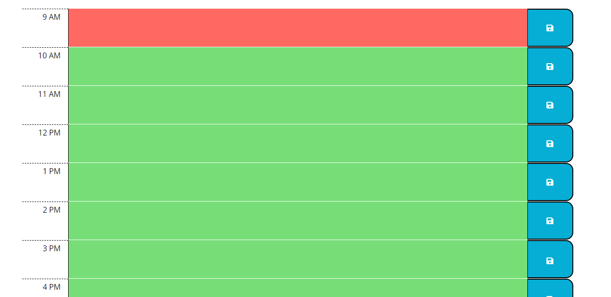

# Daily-Planner
## Description
 
 This project was to create a daily planner that allows the user to input events in time blocks during a business day. When the save button is clicked the contents are saved locally for the user.
## Installation

N/A

## Usage

Follow this [link](https://josephfanderson.github.io/Daily-Planner) to be taken to the webpage. Once there you will be displayed todays date and the event planner. The time slots are color coded based on whether they are in the past, present, or future based on the users time.

You can click on the middle section of each row in order to input text to the textarea. Once that is completed click the blue button on the right of the row in order to save the information locally. This information will be retrieved on future returns to the planner in the same day.

## Credits

Third Party APIs used
 
 - Bootstrap
 - Font Awesome
 - Moment.js
 - JQuery

## License

N/A